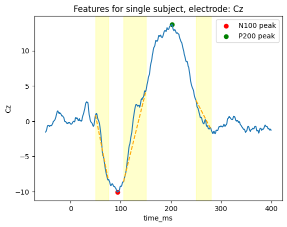
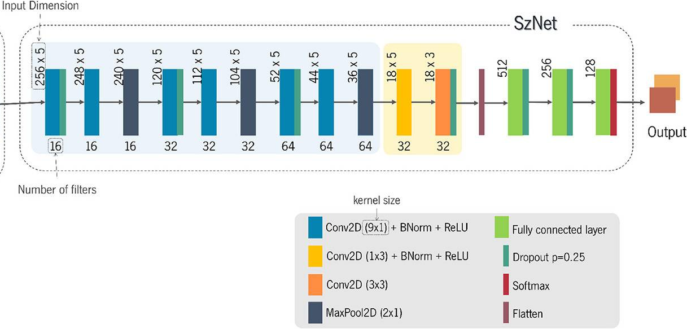
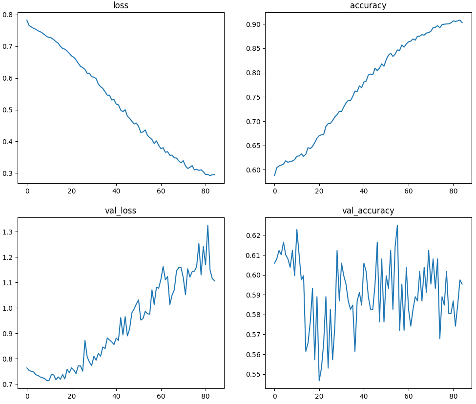
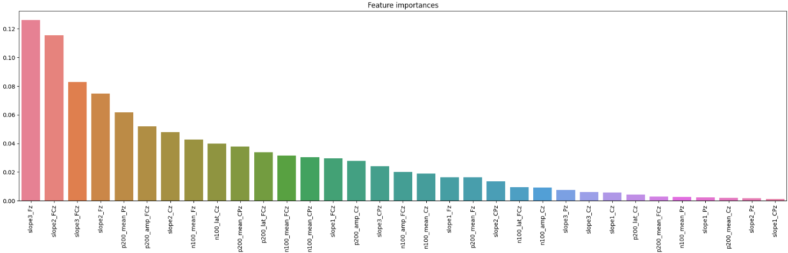

# EEG-based Schizophrenia detection

Authors: Jakub Gałecki, Szymon Stępień

## 1. Introduction

This lab project endeavors to replicate and validate findings from a research study on schizophrenia, as detailed in the provided paper [1]. The original study employed EEG technology, alongside deep learning techniques, to analyze brain activity patterns in schizophrenia patients. Through this replication effort, we aim to not only confirm the previous results but also to deepen our understanding of the EEG-based biomarkers associated with schizophrenia, particularly focusing on the auditory task-induced N100 and P200 ERP components.

### 1.1. Domain description
Schizophrenia, a complex and chronic mental health disorder, significantly impacts cognitive and social functioning. Characterized by a spectrum of symptoms including delusions, hallucinations, and cognitive challenges, it presents a considerable research focus in the field of neuropsychiatry. The Electroencephalogram (EEG), a tool for recording the brain's electrical activity, has been instrumental in advancing our understanding of schizophrenia. By capturing the brain's response to stimuli, EEG helps in probing the neurological underpinnings of this disorder.

Humans can suppress their brains' responses to sensory consequences resulting from their actions by utilizing a corollary discharge forward model system. This involves transmitting an "efference copy" of an impending motor plan from the motor to the sensory cortex, generating a "corollary discharge" representation of the expected sensory outcomes. A potential rationale for certain schizophrenia symptoms is that disruptions in the corollary discharge process within the nervous system may hinder patients' ability to distinguish between stimuli generated internally and those from external sources. 

A critical aspect of EEG studies in schizophrenia is the implementation of auditory tasks. These tasks are designed to elicit specific brain responses, notably the N100 and P200 event-related potentials (ERPs). The N100 is a negative wave appearing approximately 100 milliseconds after an auditory stimulus, primarily associated with sensory processing of sounds. In contrast, the P200 is a positive wave emerging around 200 milliseconds post-stimulus, linked to the cognitive aspects of auditory information processing. Studies have found that healthy subjects have capabilities to surpress these responses, but patients with schizophrenia don't. This observed distinction holds promise for facilitating the diagnosis of the disorder.

The integration of deep learning techniques, such as convolutional neural networks, in analyzing EEG data would be a significant advancement in schizophrenia research. These computational approaches could enhance the precision of schizophrenia classification and prediction, offering deeper insights into its complex neural mechanisms. This lab project, rooted in these methodologies, aims to further our comprehension of schizophrenia through innovative EEG analysis.

## 2. Methods

We implemented two approaches to solving this problem:
- a classical one that uses feature extraction based on studies on schizophrenia,
- a deep learning one that attempts to solve the problem without any domain knowledge.

### 2.1. Dataset

EEG data were recorded using a 64-channel system during the passive listening task, involving the presentation of 100 sounds: 1,000 Hz, 80 dB sound pressure level (SPL), 50 ms duration tones. Individual segments (trials - one per tone presented) were created from continuous recordings with a duration of 3000 ms, time-locked to tone onset with 1500 ms pre-stimulus and 1500 ms post-stimulus. Basic preprocessing was performed prior to uploading the dataset, the preprocessing included filtering, removing outliers, removing muscle and white noise artifacts. The dataset containts samples for 81 subjects - 49 schizopchrenic and 32 healthy. For each subject, about 100 trials were available.

### 2.2. Classical approach

For the classical approach, we utilized ERP (Event-Related Potentials) from EEG recordings. These signals are derived from averaging signals across all trials for a specific electrode.

In our experiments, we focused on 5 middle-scalp electrodes (Fz, FCz, Cz, CPz, Pz) and generated features from the ERP data. For all electrodes, we calculated the slopes of signal transitions before the N100, between N100 and P200, and after the P200 responses. We also computed the average signal values for the time ranges corresponding to these responses (the areas between the yellow regions shown below). Specifically, for the FCz and Cz electrodes, we included the amplitudes and latencies of the N100 and P200 peaks, as illustrated in the diagram.

  

By using averages, we were able to transform the data from time series into a single 1xN vector for each sample. Although RandomForest is an effective classifier for baseline models, it cannot process time series data directly. This led us to work with 33 features. To select the best combination of features, we applied Recursive Feature Elimination with Cross-Validation (RFECV). Additionally, we employed Stratified Cross-Validation for evaluating the accuracy on the test dataset.

### 2.3. Deep learning approach

For a deep learning approach, we used individual trial signals, also for the same 5 electrodes. First, we normalized signals for each electrodes, then we selected a time window from -100 to 400 ms time-locked to sound onset, comprising the expected latencies of N100 and P200 peaks. Then we subsampled those 512 samples ending up with 256 samples per trial.

We implemented the model as proposed in [1]. First, we used a temporal convolution blocks built of the following layers:
- 1D convolution applied individually to each electrode, followed by batch normalization and dropout,
- same as above but without dropout,
- 1D max polling, which reduces time dimension twice

We used 3 such blocks, then we used a single block of spatial convolutions (applied on different electrodes, but for the same time offset), followed by batch normalization. Then we used a 2D convolution, followed by the dropout and flatten layers. Finally, we had 3 feed-forward networks with dropouts that perform the final classification. The whole architecture is depicted below.

  

The temporal blocks were meant to find correlations between points in the temporal course of the EEG data, spatial convolutions were meant for correlating features from different electrodes. 2D convolutions were used to ensure that patterns are learned from both dimensions.

## 3. Results 

We trained a random forest classifier with 100 estimators, Gini criterion, maximum number of features set to 15 and a maximum depth of 2. We tested other configurations, mostly changing maximum number of features and number of classifiers, but this one gave the best results.

We achieved the following results:

| metric   | score  |
| -------- | -----  |
| accuracy | 0.65   |
| precision| 0.79   |
| recall   | 0.66   |
| f1       | 0.7    |
| specificity | 0.73|

As for the neural network, we tested mutliple parameters, we also tried applying stronger regularization techniques (larger dropout, L2 penalty) and reducing layer sizes or even removing 1 feed-forward layer, but the network was overfitting nevertheless. We didn't obtain any valid results and accuracy was about 0.55. Plots below illustrate one of the trainig processes.

  

## 4. Discussion

We didn't manage to reproduce the results of [1], where the same network architecture managed to achieve almost 0.8 accuracy. The probable reason is due to the size of the dataset, authors of [1], in addition to the dataset used by us, had about twice as much data that they collected themselves. They also had the same proportion of healthy and schizophrenic subjects, whereas we had about 70% schizophrenic subjects. The authors didn't comment on the reason of collecting additional data, we can only guess that results were significantly worse without that.

The simpler, classical approach with random forest performed better and achieved about 0.07 worse accuracy (0.65) than the accuracy obtained in [1], but again, results are not directly comparable as datasets were different. We can conclude that the features used are indeed helpful in predicting whether the subject suffers from schizophrenia. The most important features are related to P200 response, especially signal transitions around P200 peak, as depicted below.

  

## References

[1] From Sound Perception to Automatic Detection of Schizophrenia: An EEG-Based Deep Learning Approach, Barros C. et al.

[2] https://www.kaggle.com/datasets/broach/button-tone-sz
